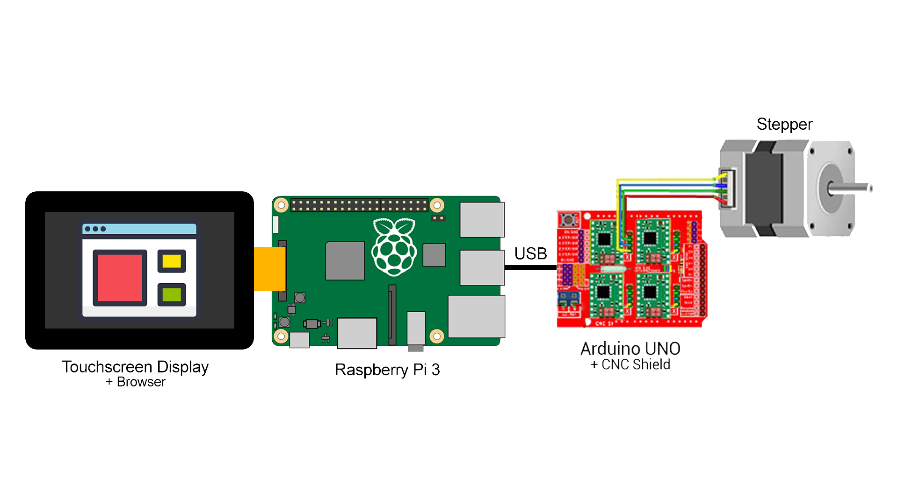
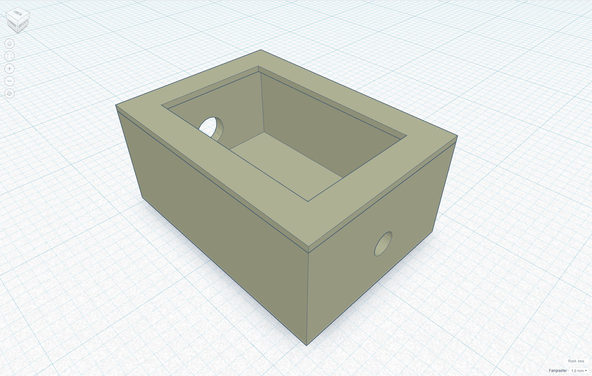

= How to build a motorized slider
Doc Writer <doc.writer@asciidoctor.org>
v0.1.0, 2020-08-01
:toc: left

== Build your own slider

With the help of SliDIY it is made possible to easily build your own motorized slider.
SliDIY is a web application which controls the movement of your slider.

=== Hardware list

camera-slider: +
https://www.amazon.de/gp/product/B06Y46H989/

stepper motor: +
https://www.amazon.de/gp/product/B00PNEQKC0/

Arduino Uno with CNC-Shield V3.0 (with USB-cable and drivers) +

touchscreen display (optional): +
https://www.amazon.de/Raspberry-Pi-7-Inch-Screen-Display/dp/B014WKCFR4 +

timing belt with accessories: +
https://www.amazon.de/gp/product/B07JGXG7S2/ref=ppx_yo_dt_b_asin_title_o00_s00?ie=UTF8&psc=1

=== Software installation

Download the Raspbian Buster Lite Image: +
https://www.raspberrypi.org/downloads/raspbian/

write the image with help of the Raspberry Pi Imager onto the sd-card: +
https://www.raspberrypi.org/downloads/

first follow the instruction of the Raspberry Pi

then unlock ssh in the raspi-config

``raspi-config`` +
In this menu change to the tab "Interfacing Options" and enable the option "SSH". After this you need to reboot your
your Raspberry Pi.

install CNCJS on the Raspberry: +

``
sudo apt-get update
``

``
sudo apt-get upgrade -y
``

``
sudo apt-get dist-upgrade -y
``

``
sudo apt-get install -y build-essential git
``

``
sudo apt-get install -y htop iotop nmon lsof screen
``

``
sudo reboot
``

``
curl -sL https://deb.nodesource.com/setup_8.x | sudo -E bash -
``

``
sudo apt install -y nodejs build-essential
``

``
sudo apt-get install -y npm
``

``
sudo npm install -g npm@latest
``

``
sudo npm install -g cncjs@latest --unsafe-perm
``

``
cncjs
``

you can now check under localhost:8000 if the installation was successful

reboot Raspberry Pi  +
``
sudo reboot
``

=== 3D-Case

We used https://www.tinkercad.com/[Tinkercad] for modeling our 3D-Case since it is made for people who have
never touched a 3D-modeling software like Blender or Cinema4D. Tinkercad is a simple web-based modeling-tool.
You have to export your 3d-model as a STL-file for the 3d-printing.

other option to Tinkercad:

* Blender
* Cinema4D
* Meshlab
* Meshmixer
* Microsoft 3D Builder

There are no strict rules on how to design your case, so model it the way you want or download our model!

