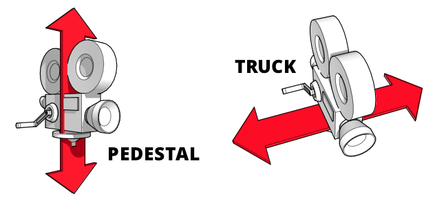

== Pflichtenheft für motorisierten Kamera-Slider

_Tea Leon & Ehmeir Franziskus_

=== Ausgangssituation

Die HTL Leonding ist eine mittelgroße Schule im Zentralraum OÖ. Einer
der vier Ausbildungsrichtungen ist IT-Medientechnik. Dort bildet die
Medienproduktion einen der Schwerpunkte der Ausbildung.

=== Ist-Situation

In Videoproduktionen werden seit vielen Jahren Slider verwendet um
stabile horizontale und vertikale Aufnahmen zu machen. Diese können
motorisiert sein oder nicht.

=== Problem

Wenn man versucht per Hand bewegte Aufnahmen zu machen, endet man meist mit verwackeltem oder sogar unbrauchbarem Videomaterial. Weiters werden die meisten Zeitrafferaufnahmen langweilig, da sie keine Bewegung beinhalten. Die Lösung dieser Probleme wären motorisierte Slidersysteme. Motorisierte Slider sind sehr teuer und meist unerschwinglich für den durchschnittlichen Anwender. Billige Alternativen sind unmotorisiert und dadurch entsteht wieder eine Verwackelungsgefahr bzw. unregelmäßige Bewegungsgeschwindigkeiten.

=== Aufgabenstellung

Es ist ein erschwingliches Slider-System zu entwickeln, das sowohl horizontale als auch schräge Kamerabewegungen durchführen kann. Die montierte Kamera wird einen vorgegeben Streckenabschnitt in einer ebenso vorgegebenen Zeit zurücklegen. Somit können z.B. auch Zeitrafferaufnahmen erstellt werden. Der Motor des Sliders wird über einen Micro-Controller angesprochen werden. Später wird das System mit einer App gesteuert werden können.

=== Ziele

Mehr filmbegeisterten Menschen soll die Möglichkeit zum Besitz eines
günstigen, motorisierten Slider-Systems geschaffen werden.

Es wird eine App zur praktischeren und bequemeren Verwendung des Systems entwickelt werden.

=== User Storys nach Scrum

Als Content-Creator möchte ich reibungslose, horizontale wie auch
vertikale Kamerabewegungen anwenden.

Als Naturfotograf möchte ich bewegte Zeitraffer erstellen.

Als Lehrer möchte ich meinen Schülern die Möglichkeit bieten mit
professionellem Equipment zu arbeiten.
