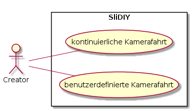
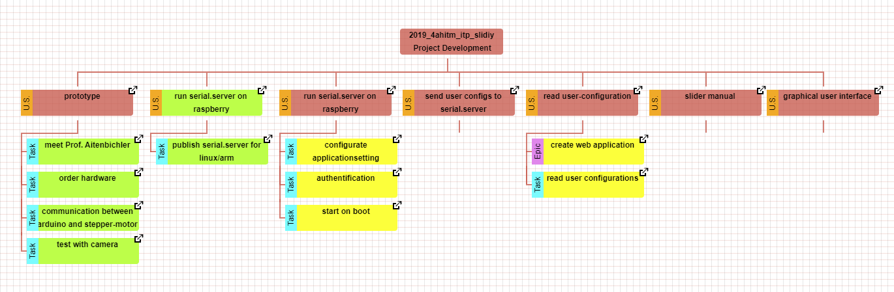
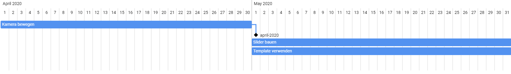

== SliDIY

An affordable slider system that can be controlled with a mobile
application via a microcontroller.

==== Authors

* *Tea Leon* - https://github.com/tealeon[TeaLeon]
* *Ehmeir Franziskus* -
https://github.com/franziskusehmeir[FranziskusEhmeir]

See also the list of
https://github.com/franziskusehmeir/SliDIY/contributors[contributors]
who participated in this project.

=== GH Page
https://franziskusehmeir.github.io/SliDIY/

=== Use Case Diagram

=== System Architecture (Hardware)

image:./images/SysArc.png[systemarchitecture]

=== Deployment Diagram

image:./images/deploymentd.PNG[deployment_diagram]

=== Youtrack Diagram

=== Gantt

