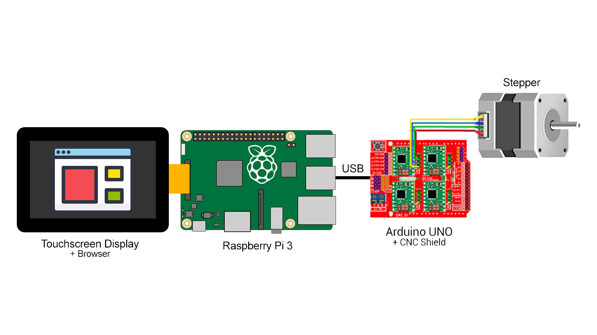

= SliDIY

== Pflichtenheft "Was mache ich"

=== Ausgangssituation

Videos werden auf verschiedenen Geräten aufgenommen, mit Handys bis zu professionellen Filmkameras.

=== Ist-Situation

In semi-professionellen Filmproduktionen ist es oft wichtig, eine 
ruhige Kamerafahrt zu erstellen.

In Videoproduktionen werden seit vielen Jahren Slider verwendet um
stabile horizontale und vertikale Aufnahmen zu machen. Diese können
motorisiert sein oder nicht.

image:.images/slides.png[Movements,title="Slides"]

=== Problemstellung

Wenn man versucht per Hand bewegte Aufnahmen zu machen, endet man meist mit verwackeltem oder sogar unbrauchbarem Videomaterial. Weiters werden die meisten Zeitrafferaufnahmen langweilig, da sie keine Bewegung beinhalten. Die Lösung dieser Probleme wären motorisierte Slidersysteme. Motorisierte Slider sind sehr teuer und meist unerschwinglich für den durchschnittlichen Anwender. Billige Alternativen sind unmotorisiert und dadurch entsteht wieder eine Verwackelungsgefahr bzw. unregelmäßige Bewegungsgeschwindigkeiten.

=== Aufgabenstellung

Es ist ein erschwingliches Slider-System zu entwickeln, das sowohl horizontale als auch schräge Kamerabewegungen durchführen kann. Die montierte Kamera wird einen vorgegeben Streckenabschnitt in einer ebenso vorgegebenen Zeit zurücklegen. Somit können z.B. auch Zeitrafferaufnahmen erstellt werden. Der Motor des Sliders wird über einen Micro-Controller angesprochen werden. Später wird das System mit einer App gesteuert werden können. Außerdem ist eine Anleitung zu erstellen, damit Leute das Slider-System nachbauen können.

==== Funktionale Anforderungen

==== Nichtfunktionale Anforderungen

Die Oberfläche gewährleistet eine gute Übersicht und eine leichte Bedienung. +
Die Komponenten des Systems sind erschwinglich. +
Es wird eine simple Anleitung zum Nachbau zur Verfügung gestellt.

=== Ziele

Filmbegeisterten Menschen soll es ermöglicht werden, mithilfe der Dokumentation selbst einen Kamera-Slider nachzubauen und ihn in Betrieb zu nehmen. Somit können sie qualitativ hochwertige Aufnahmen erstellen, die frei von Verwacklungen und Geschwindigkeitsnderungen sind.

=== User Storys nach Scrum

Als Content-Creator möchte ich reibungslose, horizontale wie auch
vertikale Kamerabewegungen anwenden.

Als Naturfotograf möchte ich bewegte Zeitraffer erstellen.

== Entwurf "Wie mache ich es"

=== System Architecture (Hardware)

=== Deployment Diagram

=== Use Case Diagram

=== Youtrack Diagram Epic

=== Youtrack Diagram Sprints

== Projekthandbuch "Organisatorische Rahmenbedigungen"

=== Gantt Diagram

