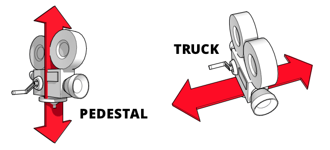

== Pflichtenheft für motorisierten Kamera-Slider

_Ehmeir Franziskus & Tea Leon_

=== Ausgangssituation

Die HTL Leonding ist eine mittelgroße Schule im Zentralraum OÖ. Einer der vier Ausbildungsrichtungen ist IT-Medientechnik. Dort bildet die Medienproduktion einen klaren Schwerpunkt der Ausbildung.

=== Ist-Situation

Horizontale und vertikale Videoaufnahmen sind händisch oft verwackelt. Um stabile Aufnahmen zu erreichen werden teure Werkzeuge benötigt.

=== Problem

Motorisierte Slider sind sehr teuer und meist unerschwinglich für den durchschnittlichen Anwender. Billige Alternativen sind unmotorisiert und dadurch entsteht wieder eine Verwackslungsgefahr bzw. unregelmäßige Bewegungsgeschwindigkeiten.

=== Aufgabenstellung
Es ist ein erschwingliches Slider-System zu entwickeln, dass über einen Micro-Controller mit einer App gesteuert werden kann.

=== Ziele

Mehr filmbegeisterten Menschen soll die Möglichkeit zum Besitz eines günstigen, motorisierten Slider-Systems geschaffen werden.

=== User Storys nach Scrum

* Als Content-Creator möchte ich reibungslose, horizontale wie auch vertikale Kamerabewegungen anwenden.
* Als Naturfotograf möchte ich bewegte Zeitraffer erstellen.
* Als Lehrer möchte ich meinen Schülern die Möglichkeit bieten mit professionellem Equipment zu arbeiten.
