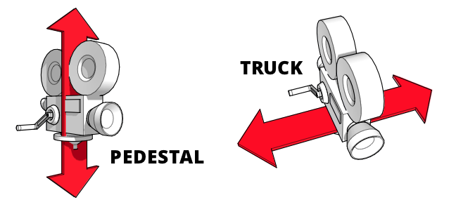

# System specification for a motorised camera-slider
_Ehmeir Franziskus & Tea Leon_

 
 

## Initial situation

The higher technical education institute Leonding is a medium-sized school in the central region of Upper Austria. One of the four departments is IT media technology. There, media production is a clear focus of the education.

 

## Status quo

In video productions, sliders have been used  to make stable horizontal and vertical shots for many years. These can be motorized or not.

 

 

## Problem definition

Motorized sliders are very expensive and usually unaffordable for the average user. Cheap alternatives are not motorised and this again creates a risk of  shaky footage or irregular camera movement speeds.

 

## Task formulation

Creation of an affordable slider system that can be controlled via a microcontroller with an app

 

## Objectives

More film-loving people should be given the opportunity to own a cheap, motorized slider system.

 

## User stories

- As a content creator, I want to create smooth, horizontal and vertical camera movements.
- As a nature photographer, I want to create a moving time lapse.
- As a teacher, I want to give my students the opportunity to work with professional equipment that is affordable.
